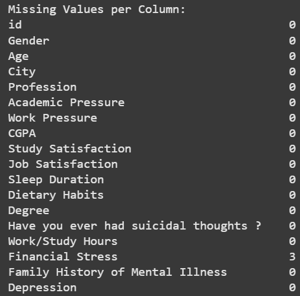
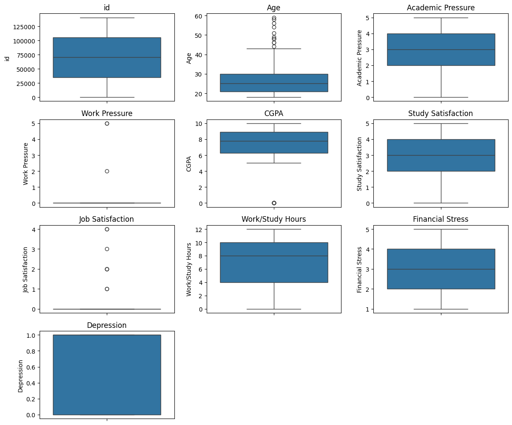
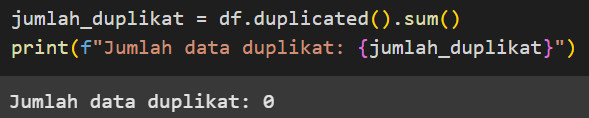
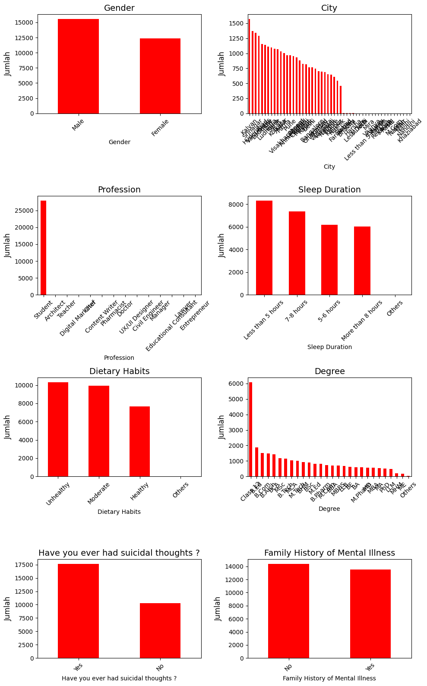
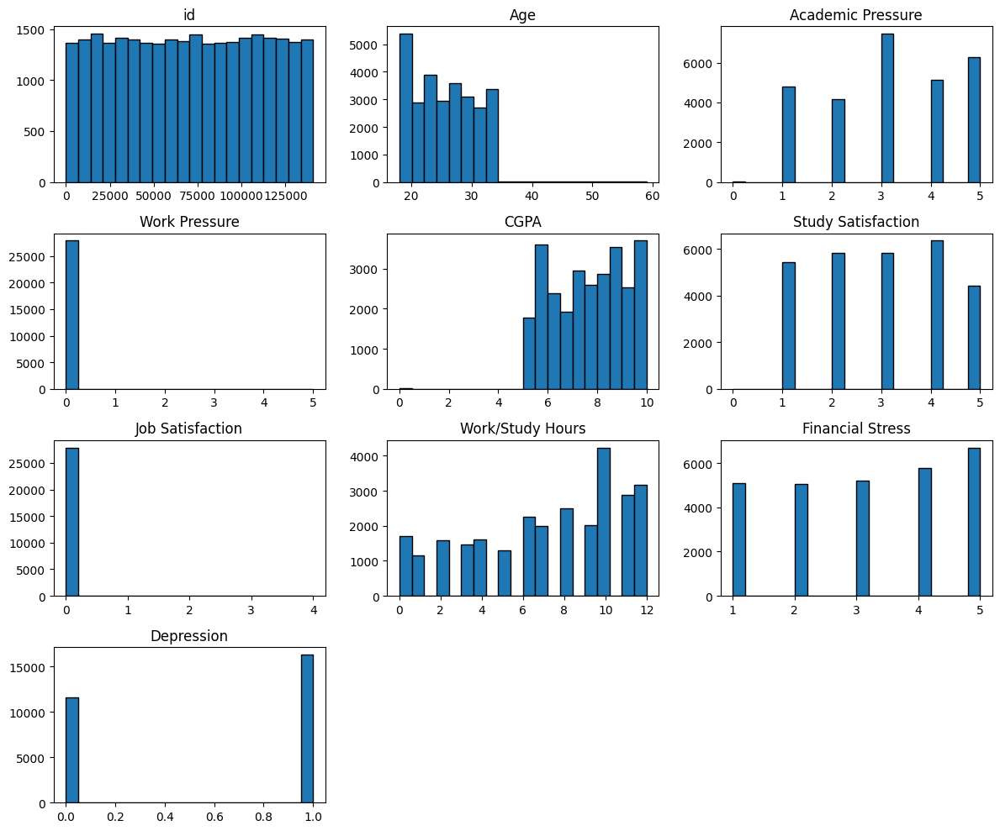
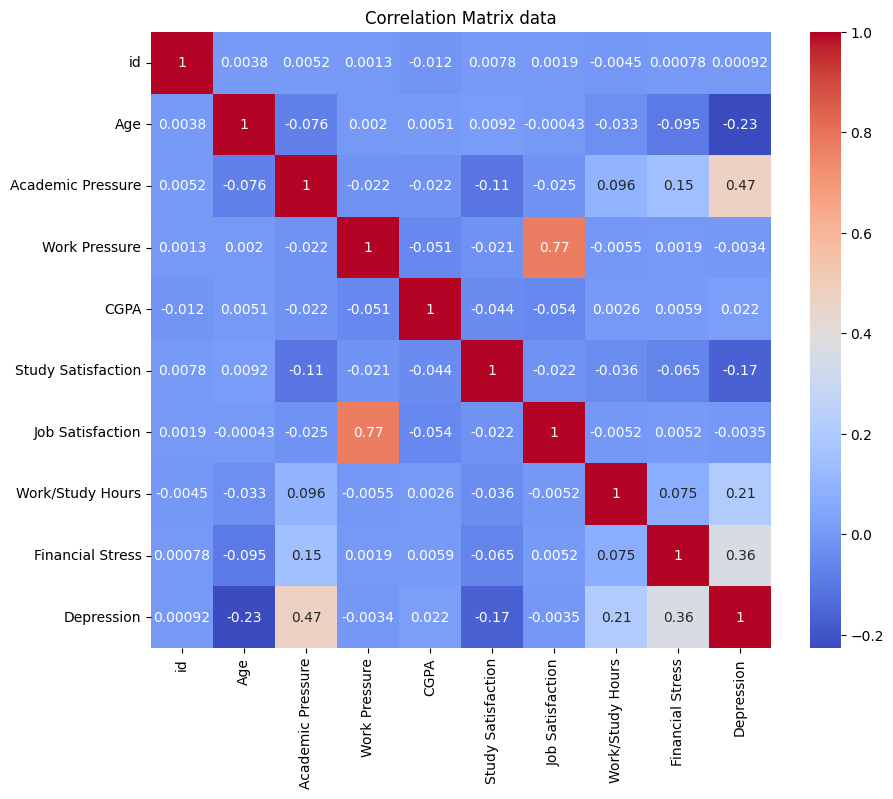
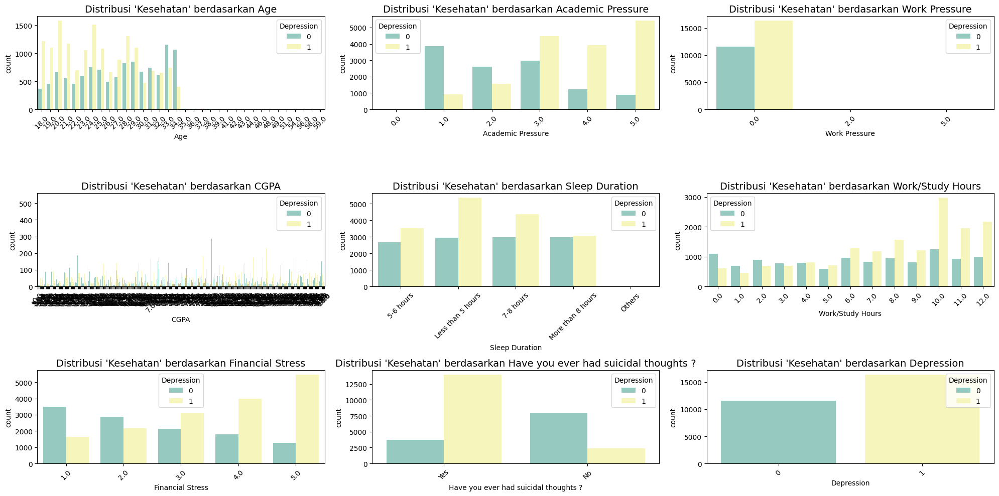
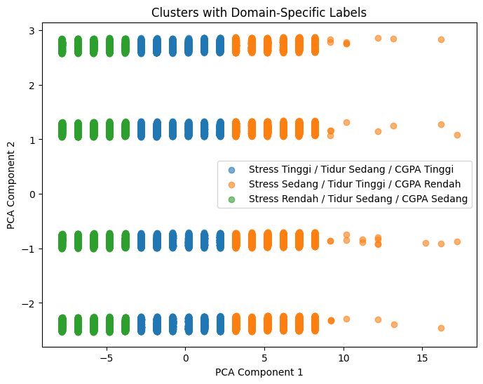

# Laporan Proyek Machine Learning - Muhamad Thirafi Qaed Setiawan

## Domain Proyek

Proyek Machine Learning ini mengangkat domain kesehatan mental. Proyek yang dibangun adalah
Prediksi Risiko Penyakit Mental pelajar yang dikembangkan berdasarkan data.

## Latar Belakang
Masalah kesehatan mental pada pelajar menjadi perhatian serius dalam beberapa tahun terakhir, seiring dengan meningkatnya tekanan akademik, sosial, dan perubahan gaya hidup digital. Berdasarkan data dari Indonesia National Adolescent Mental Health Survey tahun 2022, sebanyak 34% remaja dilaporkan mengalami masalah kesehatan mental, seperti stres berat, kecemasan, hingga depresi ringan hingga sedang. Selain itu, laporan dari Kementerian Pendidikan, Kebudayaan, Riset, dan Teknologi menunjukkan bahwa lebih dari 20% pelajar di Indonesia menunjukkan gejala gangguan emosi yang memengaruhi konsentrasi belajar dan interaksi sosial. Kondisi ini menegaskan bahwa kesehatan mental pelajar merupakan isu strategis yang memerlukan perhatian dari berbagai pihak, termasuk institusi pendidikan, tenaga kesehatan, orang tua, dan pembuat kebijakan.
 
Di tengah kompleksitas faktor penyebab gangguan mental pada pelajar, mulai dari tekanan akademik, pekerjaan , keuangan, gaya hidup, hingga masalah keluarga, dibutuhkan pendekatan yang proaktif dan terukur untuk mendeteksi risiko sejak dini. Pemanfaatan teknologi, khususnya pendekatan berbasis machine learning, memberikan peluang besar untuk melakukan prediksi dan pemetaan risiko kesehatan mental secara lebih objektif dan efisien. Dengan menganalisis berbagai data seperti kebiasaan belajar, interaksi sosial, gaya hidup digital, dan hasil survei psikologis, sistem berbasis kecerdasan buatan dapat membantu mengidentifikasi pola-pola yang mengarah pada potensi gangguan mental pada pelajar.
 
Pengembangan model prediktif ini diharapkan dapat menjadi langkah awal dalam menciptakan sistem pendukung berbasis teknologi yang mampu memberikan peringatan dini (early warning system), mendukung pengambilan keputusan, serta memfasilitasi intervensi yang lebih cepat dan tepat sasaran. Dalam jangka panjang, integrasi teknologi ini ke dalam sistem pendidikan dapat menjadi salah satu strategi preventif dalam membangun ekosistem pembelajaran yang lebih sehat secara mental dan emosional.

## Business Understanding

### Problem Statements
Berdasarkan latar belakang yang telah disampaikan, terdapat beberapa rumusan masalah yang akan diselesaikan pada proyek ini:
1. Faktor-faktor apa saja yang memengaruhi tingkat risiko gangguan kesehatan mental pada pelajar?
2. Bagaimana cara membangun model machine learning untuk memprediksi kondisi kesehatan mental pelajar berdasarkan data yang tersedia?
3. Bagaimana cara memilih model machine learning yang paling optimal berdasarkan metrik evaluasi seperti akurasi, precision, recall, dan F1-score untuk kasus prediksi kesehatan mental pelajar?

### Goals
Proyek ini dibangun dengan tujuan:
1. Mengidentifikasi variabel-variabel yang berkontribusi signifikan terhadap risiko gangguan kesehatan mental pada pelajar, seperti tekanan akademik, stres finansial, dan kepuasan belajar.
2. Membangun dan melatih model machine learning untuk melakukan klasifikasi kondisi kesehatan mental pelajar berdasarkan fitur numerik dan kategorikal.
3. Mengevaluasi dan membandingkan beberapa algoritma machine learning guna menentukan model terbaik berdasarkan akurasi, precision, recall, dan F1-score dalam memprediksi risiko kesehatan mental pelajar.

### Solution Statements
Untuk mencapai tujuan dalam studi kasus ini, dilakukan beberapa tahapan solusi sebagai berikut:
1. Melakukan eksplorasi dan analisis data untuk memahami karakteristik dataset yang terdiri dari fitur numerik dan kategorikal, seperti Academic Pressure, Financial Stress, Sleep Duration, dan Family History of Mental Illness. Tahapan ini mencakup pembersihan data (data cleaning), transformasi data kategorikal, visualisasi distribusi variabel, serta analisis korelasi untuk mengidentifikasi fitur-fitur yang paling berpengaruh terhadap risiko gangguan kesehatan mental.
2. Membangun model machine learning klasifikasi untuk memprediksi status kesehatan mental pelajar berdasarkan fitur yang telah diolah. Dalam proyek ini, tiga algoritma klasifikasi digunakan:
    - **Naive Bayes**: Model probabilistik yang efisien dan cocok untuk data kategorikal dan numerik yang bersih serta bebas multikolinearitas.
    - **Decision Tree**: Model yang mudah diinterpretasi dan mampu menangani relasi non-linear antara fitur dan label.
    - **Support Vector Machine (SVM)**: Model yang efektif dalam menangani data berdimensi tinggi dan memisahkan kelas dengan margin maksimal.
3. Melakukan evaluasi dan pemilihan model terbaik dengan membandingkan performa masing-masing model berdasarkan metrik evaluasi seperti akurasi, precision, recall, dan F1-score. Hasil evaluasi akan digunakan untuk menentukan model yang paling akurat dan andal dalam memprediksi risiko gangguan kesehatan mental pelajar.

## Data Understanding
Sumber Dataset kaggle: [Student Depression Dataset.](https://www.kaggle.com/datasets/hopesb/student-depression-dataset)

 Berikut adalah ringkasan variabel:

Dataset yang digunakan adalah *Student Depression Dataset* dari Kaggle, berisi **27.901 baris** dengan **18 kolom**, yang merepresentasikan berbagai informasi demografis, akademik, gaya hidup, dan kondisi kesehatan mental pelajar. Berikut adalah penjelasan masing-masing kolom didata:

- **id**: Identifier unik untuk setiap responden.  
- **Gender**: Jenis kelamin responden (Male, Female, Non-binary, dan Prefer not to say).  
- **Age**: Usia responden dalam tahun.  
- **City**: Kota tempat tinggal responden.  
- **Profession**: Pekerjaan responden (Student, Employed, Self-employed, dan Unemployed).  
- **Academic Pressure**: Tingkat tekanan akademik yang dirasakan responden, diberikan dalam skala numerik (misalnya 1–10).  
- **Work Pressure**: Tingkat tekanan pekerjaan yang dirasakan responden, dalam skala numerik (misalnya 1–10).  
- **CGPA**: Indeks prestasi kumulatif (Cumulative Grade Point Average) responden, skala 0–4 (atau nilai setara di sistem lokal).  
- **Study Satisfaction**: Tingkat kepuasan belajar responden, dalam skala numerik (misalnya 1–10).  
- **Job Satisfaction**: Tingkat kepuasan terhadap pekerjaan atau magang responden, dalam skala numerik (misalnya 1–10).  
- **Sleep Duration**: Rata-rata durasi tidur per hari responden, dalam jam (contoh: 6.5 artinya 6 jam 30 menit).  
- **Dietary Habits**: Kebiasaan pola makan responden (Healthy, Unhealthy, dan variasi lain sesuai kuesioner).  
- **Degree**: Tingkat pendidikan atau jurusan responden (misalnya Bachelor, Master, Diploma).  
- **Have you ever had suicidal thoughts ?**: Indikator apakah responden pernah memiliki pemikiran bunuh diri (Yes/No).  
- **Work/Study Hours**: Jumlah jam per hari yang dihabiskan responden untuk bekerja atau belajar.  
- **Financial Stress**: Tingkat stres finansial yang dialami responden, dalam skala numerik (misalnya 1–10).  
- **Family History of Mental Illness**: Apakah ada riwayat penyakit mental dalam keluarga inti responden (Yes/No).  
- **Depression**: Label target, menandakan status depresi (0 = tidak depresi, 1 = depresi).

### Variable - variable pada dataset
- Data Integer = age, stress_level, physical_activity_days, depression_score, anxiety_score, social_support_score.  
- Data Float = sleep_hours, productivity_score.  
- Data Object = gender, employment_status, work_environment, mental_health_history, seeks_treatment, mental_health_risk.

### Missing Value, Data Duplikat dan Outlier
- ditemukan missing value di dalam dataset sebanyak 3 data.
      
- ditemukan outlier di dalam dataset yaitu pada 3 kolom yaitu Age, Work Pressure, Job Satisfaction.
      
- Tidak ditemukan data duplikat di dalam dataset.
    

### EDA - Univariate Analysis
Analisis univariat dilakukan untuk memahami distribusi masing-masing variabel secara individual. Beberapa temuan awal:

#### Kolom Categorical 

- Terdapat 2 kategori dalam fitur **Gender**, didominasi oleh **Male** (15 547) dan **Female** (12 354) dengan perbandingan sekitar 55% vs 45%.  
- Terdapat 52 kategori dalam fitur **City**, dengan tiga kota terbanyak: **Kalyan** (1 570), **Srinagar** (1 372), dan **Hyderabad** (1 340); puluhan entri hanya muncul sekali sehingga sebaiknya digabung ke “Others”.  
- Terdapat 14 kategori dalam fitur **Profession**, sangat didominasi oleh **Student** (27 870), sedangkan kategori lain jumlahnya sangat kecil (<10).  
- Terdapat 5 kategori dalam fitur **Sleep Duration**, secara berurutan: **Less than 5 hours** (8 310), **7–8 hours** (7 346), **5–6 hours** (6 183), **More than 8 hours** (6 044), dan **Others** (18).  
- Terdapat 4 kategori dalam fitur **Dietary Habits**, secara berurutan: **Unhealthy** (10 317), **Moderate** (9 921), **Healthy** (7 651), dan **Others** (12).  
- Terdapat 28 kategori dalam fitur **Degree**, dengan paling banyak **Class 12** (6 080), diikuti **B.Ed** (1 867) dan **B.Com** (1 506); banyak kategori jarang (<200) yang sebaiknya dikelompokkan.  
- Terdapat 2 kategori dalam fitur **Have you ever had suicidal thoughts?**, yaitu **Yes** (17 656) dan **No** (10 245), dengan ~63% responden pernah berpikir bunuh diri.  
- Terdapat 2 kategori dalam fitur **Family History of Mental Illness**, yaitu **No** (14 398) dan **Yes** (13 503), dengan proporsi relatif cukup seimbang yiatu (52% vs 48%).  

#### Kolom Numerik

- **id**: Terdiri dari 27 901 nilai unik (satu per baris), menandakan kolom ini hanya sebagai identifier dan tidak berkontribusi ke pola data.  
- **Age**: Terdapat 34 nilai usia berbeda; puncak pada usia 24 (2 258), 20 (2 237), dan 28 (2 133). Sebagian besar responden berusia 18–34 tahun, dengan sedikit outlier (>35 tahun).  
- **Academic Pressure**: 6 kategori (0–5), didominasi nilai 3 (7 462), 5 (6 296), 4 (5 155), 1 (4 801), dan 2 (4 178). Hanya 9 responden melaporkan nol tekanan.  
- **Work Pressure**: 3 kategori, hampir seluruhnya 0 (27 898), hanya 3 responden melaporkan tekanan kerja >0. Fitur ini hampir konstan dan perlu dipertimbangkan ulang.  
- **CGPA**: 332 nilai unik, berkisar 0–10; mayoritas di rentang 5–10 dengan puncak pada 8,04 (821) dan 9,96 (425). Menunjukkan kinerja akademik umumnya tinggi.  
- **Study Satisfaction**: 6 kategori (0–5), didominasi nilai 4 (6 359), 2 (5 838), 3 (5 821), 1 (5 451), 5 (4 422). Hanya 10 responden sangat tidak puas (0).  
- **Job Satisfaction**: 5 kategori, hampir semua 0 (27 893), sisanya tersebar sangat jarang (1–4). Mirip dengan Work Pressure, fitur ini kurang informatif.  
- **Work/Study Hours**: 13 nilai (0–12 jam), puncak pada 10 jam (4 234), 12 jam (3 172), dan 11 jam (2 892). Menunjukkan sebagian besar menghabiskan 8–12 jam per hari.  
- **Financial Stress**: 5 kategori (1–5), didominasi nilai 5 (6 715) dan 4 (5 775), artinya tekanan finansial cenderung tinggi pada responden.  
- **Depression (target)**: Dua kelas, dengan 16 336 (≈58,5 %) positif depresi dan 11 565 (≈41,5 %) negatif. Menunjukkan ketidakseimbangan yang perlu diperhatikan dalam pemodelan .  

##### Correation Matrix

- **Academic Pressure** menunjukkan korelasi positif tertinggi dengan **Depression** (0.47), artinya semakin tinggi tekanan akademik, semakin besar kemungkinan gejala depresi.  
- **Financial Stress** juga berkorelasi positif sedang dengan **Depression** (0.36), menandakan bahwa beban finansial menjadi faktor risiko kedua setelah tekanan akademik.  
- **Work/Study Hours** memiliki korelasi positif moderat dengan **Depression** (0.21), yang bisa diartikan bahwa jam belajar/kerja yang panjang berhubungan dengan peningkatan risiko depresi.  
- **Age** berkorelasi negatif dengan **Depression** (–0.23), menunjukkan bahwa peserta yang lebih muda cenderung melaporkan tingkat depresi lebih tinggi.  
- **Study Satisfaction** memiliki korelasi negatif kecil dengan **Depression** (–0.17), menandakan bahwa kepuasan studi sedikit menurunkan risiko depresi.  
- **CGPA**, **Work Pressure**, dan **Job Satisfaction** hampir tidak berkorelasi dengan **Depression** (< 0.03), sehingga kontribusinya dalam prediksi depresi diperkirakan minimal.  
- **Work Pressure** dan **Job Satisfaction** sangat berkorelasi satu sama lain (0.77), menandakan kemungkinan duplikasi informasi—sebaiknya hanya salah satu yang dipakai.  
- Kolom **id** tidak berkorelasi signifikan dengan fitur apapun (< 0.01), sehingga bisa dihapus sebagai identifier tanpa kehilangan informasi.  

##### outliner

- **Age**  
  - Sebagian besar usia terpusat pada 18–34 tahun (IQR ≈ 21–30).  
  - Terdapat outlier usia >35 tahun (hingga ≈ 59), perlu dicek apakah ini partisipan lanjut usia atau kesalahan input.

- **Academic Pressure**  
  - Distribusi terpusat pada 2–4, tanpa outlier signifikan di luar rentang 0–5.

- **Work Pressure**  
  - Hampir semua nilai 0, kecuali tiga responden (skor 2 dan 5) yang muncul sebagai outlier—menunjukkan mayoritas tidak memiliki beban kerja sampingan.

- **CGPA**  
  - Sebagian besar di rentang 5–10, tetapi ada satu nilai 0 yang jelas outlier (tidak valid) dan perlu diperbaiki atau dihapus.

- **Study Satisfaction**  
  - Sebagian besar skor 1–5, dengan beberapa very-low score (0) muncul sebagai outlier. Perlu verifikasi apakah 0 tersebut missing value tersembunyi.

- **Job Satisfaction**  
  - Didominasi nilai 0, sedangkan nilai 1–4 hanya beberapa sampel saja—kategori yang muncul sebagai outliner.

### EDA - Multivariate Analysis

 
- **Age**  
  Meskipun jumlah total responden tertinggi ada di rentang 20–30 tahun (khususnya 24 dan 28 tahun), hampir di semua kategori umur jumlah kasus depresi (bar kuning) selalu melebihi non-depresi (bar hijau).  

- **Academic Pressure**  
  Semakin tinggi tekanan akademik, proporsi depresi juga meningkat:  
  - AP=5 dan 4 didominasi kasus depresi  
  - AP=3 relatif seimbang  
  - AP=1–2 lebih banyak non-depresi  

- **Work Pressure**  
  Hampir semua responden melaporkan WP=0, sehingga fitur ini tidak membedakan kasus depresi.  

- **CGPA**  
  Kasus depresi dan non-depresi tersebar merata di seluruh rentang CGPA, menandakan CGPA bukan prediktor kuat.  

- **Sleep Duration**  
  - Tidur <5 jam dan 5–6 jam → proporsi depresi lebih tinggi  
  - Tidur 7–8 jam dan >8 jam → lebih seimbang atau sedikit didominasi non-depresi  

- **Work/Study Hours**  
  Beban jam belajar/kerja tinggi (10–12 jam) berhubungan dengan peningkatan proporsi depresi, sedangkan jam rendah (0–4 jam) cenderung lebih banyak non-depresi.  

- **Financial Stress**  
  Tekanan finansial tinggi (skor 4–5) didominasi responden depresi, sedangkan skor rendah (1–2) lebih banyak non-depresi.  

- **Suicidal Thoughts**  
  Hampir seluruh yang pernah berpikir bunuh diri (Yes) juga berstatus depresi, sedangkan yang tidak (No) sebagian besar non-depresi.  

- **Target Imbalance**  
  Label `Depression` menunjukkan ~16 300 positif vs ~11 500 negatif, perlu penanganan imbalance (misal resampling atau threshold tuning) pada tahap pemodelan.

## Data Preparation
- menghapus missing value
- Mengonversi **Gender** dan **City** ke tipe `category` untuk menghemat memori dan memudahkan encoding fitur kategorikal.  
- Menyederhanakan nama kolom `Have you ever had suicidal thoughts ?` menjadi `Suicidal_Thoughts` dan mengubah nilainya menjadi **1** (Yes) dan **0** (No), serta `Family History of Mental Illness` juga menjadi **1** atau **0**.  
- Membersihkan kolom **Sleep Duration** dengan menghapus tanda kutip dan spasi ekstra, sehingga menghasilkan lima nilai bersih:  
  - `Less than 5 hours`  
  - `5-6 hours`  
  - `7-8 hours`  
  - `More than 8 hours`  
  - `Others`  
- Memetakan ke angka (`4.0`, `5.5`, `7.5`, `9.0`) dan mengubah `Others` menjadi NaN, lalu mengisi NaN tersebut dengan median durasi tidur (sekitar 7.5 jam) agar tidak terjadi data hilang.  
- Secara eksplisit mengubah **Sleep_Duration_Num** ke `float`, dan mengonversi semua kolom numerik lain (`Age`, `Academic Pressure`, dsb.) ke tipe numerik dengan `errors='coerce'`, memastikan data siap untuk analisis statistik dan pemodelan.
#### menghapus outliner 
- melakukan metode penghapusan outliner dengan IQR Method
- Pertama memilih **semua kolom numerik** (termasuk `id` dan `Depression`) untuk dihitung Q1, Q3, dan IQR-nya, lalu menghapus **setiap baris** yang mengandung nilai di luar `Q1 – 1.5×IQR` atau di atas `Q3 + 1.5×IQR` pada **kolom manapun**.  

#### Feature Engineering

##### 1. Pembuatan kolom `Stress_Score`
Untuk mengukur beban tekanan secara menyeluruh, dua fitur numerik—**Academic Pressure** dan **Work Pressure**—digabungkan dengan mengambil rata-ratanya. Hasilnya disimpan di kolom baru `Stress_Score`, yang merefleksikan intensitas tekanan gabungan dari aspek akademik dan pekerjaan.

##### 2. Scaling Fitur Gaya Hidup
Tiga fitur raw—`Sleep_Duration_Num`, **Study Satisfaction**, dan **Job Satisfaction**—memiliki rentang skala yang berbeda, sehingga perlu dinormalisasi agar kontribusinya seimbang. Digunakan `StandardScaler` untuk mentransformasikan masing-masing fitur menjadi distribusi mean 0 dan standard deviation 1. Hasil scaling disimpan sebagai kolom baru dengan akhiran `_scaled`:
- `Sleep_Duration_Num_scaled`
- `Study_Satisfaction_scaled`
- `Job_Satisfaction_scaled`

##### 3. Metrik Komposit `Lifestyle_Balance`
Dari hasil scaling, dibentuk satu metrik komposit bernama `Lifestyle_Balance` dengan pemberian bobot:
- **40 %** pada `Sleep_Duration_Num_scaled`
- **30 %** pada `Study_Satisfaction_scaled`
- **30 %** pada `Job_Satisfaction_scaled`

Dengan demikian, `Lifestyle_Balance` mencerminkan keseimbangan gaya hidup pelajar secara terpadu.

#### Clustering
- **Pemilihan Fitur untuk Clustering**  
  Dengan memasukkan **usia (Age)**, **kinerja akademik (CGPA)**, **durasi tidur (Sleep_Duration_Num)**, **Stress_Score** (gabungan tekanan akademik & kerja), dan **Lifestyle_Balance** (gabungan kualitas tidur & kepuasan studi/kerja), clustering menitikberatkan pada kombinasi demografi, performa akademik, dan kesejahteraan mental.

- **Pembagian ke Tiga Segmen (K=3)**  
  Menggunakan K-Means dengan `n_clusters=3` membagi populasi pelajar ke dalam tiga kelompok berdasarkan kemiripan profil kelima fitur tersebut. Parameter `random_state=42` memastikan hasil yang **reproducible**.

- **Reduksi Dimensi untuk Visualisasi**  
  PCA mereduksi kelima fitur menjadi dua komponen utama (`Component1` & `Component2`), memungkinkan plot scatter 2D di mana masing-masing titik berwarna menurut label `Cluster`.  
  - **Component1** dan **Component2** memaksimalkan variansi data, sehingga cluster lebih mudah diidentifikasi secara visual.

-  Profiling Statistik Tiap Klaster
    - **Mean Values**  
      Data dikelompokkan berdasarkan kolom `Cluster`, lalu dihitung rata-rata setiap fitur di `cluster_features` untuk masing-masing klaster. Hasil ini (`cluster_profile_mean`) menunjukkan “profil tipikal” klaster (mis. stres tinggi/rendah, durasi tidur, CGPA).
    
    - **Standard Deviations**  
      Menghitung standar deviasi (`cluster_profile_std`) pada fitur yang sama per klaster. Standar deviasi rendah menandakan anggota klaster seragam, sedangkan tinggi menunjukkan variasi internal yang besar.

- Pemberian Label yang Mudah Diinterpretasi
    - Dibuat dictionary `cluster_labels` yang memetakan angka klaster (0, 1, 2) ke deskripsi domain-spesifik (“Stress Tinggi / Tidur Sedang / CGPA Tinggi”, dll.).
    - Label ini lalu di-*map* ke kolom baru `Cluster_Label` pada DataFrame, sehingga setiap baris memuat deskripsi klaster yang mudah dipahami.

- Visualisasi Hasil Klaster dengan PCA
    - Menggunakan dua komponen PCA (`Component1`, `Component2`) untuk mereduksi dimensi dan memvisualisasikan klaster.
    - Setiap titik pada scatter plot diwarnai berdasarkan `Cluster_Label` dengan `alpha=0.6` agar area overlap tetap terlihat.
    - Sumbu, judul, dan legenda ditambahkan untuk memudahkan pembacaan plot.

## Modeling

- **Naive Bayes** adalah algoritma klasifikasi probabilistik yang bekerja berdasarkan Teorema Bayes dengan asumsi independensi antar fitur. Setiap fitur dianggap berkontribusi secara terpisah terhadap probabilitas kelas akhir. Dalam praktiknya, varian GaussianNB sering digunakan untuk data numerik, dengan parameter `var_smoothing` (default ≈1e-9) untuk menghindari pembagian nol. Naive Bayes sangat cepat dalam pelatihan dan prediksi, efisien pada dataset besar, serta tahan terhadap data berdimensi tinggi. Namun, asumsi “independen” jarang terpenuhi di dunia nyata, sehingga performanya bisa menurun jika fitur saling berkorelasi, dan model mudah memberikan probabilitas nol jika tidak ada contoh dari kombinasi fitur tertentu di data latih.

- **Decision Tree** adalah model berbasis pohon keputusan yang memisahkan data dengan memilih titik split pada tiap node berdasarkan metrik seperti Gini impurity (`criterion="gini"`) atau Information Gain (`criterion="entropy"`). Hyperparameter penting meliputi `max_depth` (kedalaman maksimum pohon), `min_samples_split` (minimal sampel untuk memecah node), dan `random_state` untuk reproduksibilitas. Decision Tree mudah diinterpretasikan—setiap cabang merepresentasikan aturan “jika–maka”—dan dapat menangani data numerik maupun kategorikal tanpa pra-pemrosesan intensif. Kelemahannya, pohon tunggal rawan overfitting pada data berisik, sangat sensitif terhadap perubahan kecil di data, dan cenderung bias memilih fitur dengan banyak level.

- **Support Vector Machine (SVM)** adalah algoritma margin-based yang mencari hyperplane optimal untuk memisahkan kelas dengan margin terlebar. Dengan kernel (“linear”, “rbf”, “poly”) SVM dapat menangani data non-linier lewat trik kernel. Dua hyperparameter utama adalah `C` (regularisasi, trade-off antara margin lebar dan kesalahan klasifikasi) dan `gamma` pada kernel RBF (pengaruh tiap titik data). SVM efektif pada data berdimensi tinggi dan memiliki daya generalisasi baik jika parameter diatur tepat. Namun, pelatihan SVM bisa lambat pada dataset besar, sensitif terhadap pilihan kernel dan skala fitur, serta kurang cocok untuk data sangat berisik karena margin yang terlalu sempit dapat menyebabkan overfitting.

## Evaluation

Evaluasi model dilakukan menggunakan metric accuracy, precision, Recall, dan F1-score untuk mengukur performa dari 
masing-masing model yang digunakan yaitu Naive Bayes, Decision Tree, dan Support Vector Machine (SVM). 
 
Metrix evaluasi yang digunakan **confusion matrix**:

|                | Prediksi Positif | Prediksi Negatif |
|----------------|------------------|------------------|
| **Aktual Positif** | True Positive (TP)  | False Negative (FN) |
| **Aktual Negatif** | False Positive (FP) | True Negative (TN)  |

---

##### 1. Accuracy
- **Definisi**: Proporsi prediksi yang benar (baik positif maupun negatif) dari seluruh sampel.  
- **Rumus**:  
  \[
    \text{Accuracy} = \frac{TP + TN}{TP + TN + FP + FN}
  \]  
- **Interpretasi**:  
  - Nilai antara 0 dan 1.  
  - Cocok jika dataset seimbang (jumlah positif dan negatif hampir sama).  
- **Keterbatasan**:  
  - Dapat menyesatkan pada data imbalanced (mis. 95 % negatif, model yang selalu prediksi negatif akan punya accuracy 95 %).

---

##### 2. Precision
- **Definisi**: Proporsi prediksi positif yang benar dari seluruh prediksi positif.  
- **Rumus**:  
  \[
    \text{Precision} = \frac{TP}{TP + FP}
  \]  
- **Interpretasi**:  
  - Menjawab “Dari semua yang diprediksi positif, seberapa banyak yang benar-benar positif?”  
  - Tinggi artinya model sedikit menghasilkan false alarms (FP rendah).  
- **Keterbatasan**:  
  - Bisa tinggi meski model melewatkan banyak positif (FN besar).

---

##### 3. Recall (Sensitivity)
- **Definisi**: Proporsi aktual positif yang berhasil diprediksi positif.  
- **Rumus**:  
  \[
    \text{Recall} = \frac{TP}{TP + FN}
  \]  
- **Interpretasi**:  
  - Menjawab “Dari semua kasus positif, seberapa banyak yang terdeteksi?”  
  - Penting saat melewatkan positif (FN) memiliki konsekuensi besar (mis. deteksi penyakit).  
- **Keterbatasan**:  
  - Bisa tinggi meski banyak false positives (FP tinggi).

---

##### 4. F1-Score
- **Definisi**: Harmonik rata-rata dari Precision dan Recall.  
- **Rumus**:  
  \[
    \text{F1-score} = 2 \times \frac{\text{Precision} \times \text{Recall}}{\text{Precision} + \text{Recall}}
  \]  
- **Interpretasi**:  
  - Nilai antara 0 dan 1.  
  - Memberi keseimbangan antara Precision dan Recall.  
  - Tinggi jika kedua metrik tersebut baik.  
- **Keterbatasan**:  
  - Tidak membedakan mana yang lebih penting antara Precision atau Recall; hanya cocok jika keduanya sama penting.

#### hasil evaluasi 
| Model                      | Accuracy | Precision (0) | Recall (0) | F1-score (0) | Precision (1) | Recall (1) | F1-score (1) |
|----------------------------|----------|---------------|------------|--------------|---------------|------------|--------------|
| **Naive Bayes**            | 0.7840   | 0.75          | 0.73       | 0.74         | 0.81          | 0.82       | 0.82         |
| **Decision Tree**          | 0.7039   | 0.64          | 0.66       | 0.65         | 0.75          | 0.74       | 0.74         |
| **Support Vector Machine** | 0.8000   | 0.78          | 0.72       | 0.75         | 0.81          | 0.86       | 0.83         |

Berdasarkan hasil pengujian pada data uji:

#### 1. Support Vector Machine (SVM) — Model Terbaik
- **Akurasi**: 80,0%  
- **Precision** (kelas 0/1): 0,78 / 0,81  
- **Recall** (kelas 0/1): 0,72 / 0,86  
- **F1-score** (kelas 0/1): 0,75 / 0,83  
- **Kelebihan**:  
  - Recall tinggi pada kelas depresi (0,86) → meminimalkan kasus terlewat  
  - Keseimbangan metrik keseluruhan terbaik  

#### 2. Naive Bayes — Model Kedua
- **Akurasi**: 78,4%  
- **Precision** (kelas 0/1): 0,75 / 0,81  
- **Recall** (kelas 0/1): 0,73 / 0,82  
- **F1-score** (kelas 0/1): 0,74 / 0,82  
- **Kelebihan**:  
  - Performa mendekati SVM  
  - Training sangat cepat, cocok untuk skenario dengan resource terbatas  

#### 3. Decision Tree — Model Terlemah
- **Akurasi**: 70,4%  
- **Precision** (kelas 0/1): 0,64 / 0,75  
- **Recall** (kelas 0/1): 0,66 / 0,74  
- **F1-score** (kelas 0/1): 0,65 / 0,74  
- **Kelemahan**:  
  - Cenderung underfit/overfit tanpa tuning  
  - Kinerja jauh di bawah dua model lainnya  

#### Rekomendasi
1. **Gunakan SVM** sebagai model utama untuk deteksi risiko depresi.  
2. Simpan **Naive Bayes** sebagai opsi cepat untuk inferensi real-time.  
3. **Optimasi Decision Tree** (pruning, `max_depth`, `min_samples_leaf`) atau pertimbangkan ensemble (Random Forest, Boosting) untuk meningkatkan akurasi. 

**Rubrik/Kriteria Tambahan (Opsional)**: 
- Menjelaskan formula metrik dan bagaimana metrik tersebut bekerja.

**---Ini adalah bagian akhir laporan---**

\n

 Laporan Proyek Pertama Kelas Machine Learning Terapan - Dwi Laras Setyadita
---
## Domain Proyek
Proyek *Machine Learning* ini mengangkat domain kesehatan. Proyek yang dibangun adalah  
*Prediksi Risiko Penyakit Mental* yang dikembangkan berdasarkan data.

## Latar Belakang
Masalah kesehatan mental dan regulasi emosi menjadi isu yang semakin memerlukan perhatian serius, khususnya di kalangan pelajar. Masa pendidikan sering kali menjadi fase yang penuh tekanan, baik dari segi akademik maupun sosial. Berdasarkan Survei Kesehatan Indonesia 2023 yang dilakukan oleh Kementerian Kesehatan, prevalensi depresi nasional mencapai 1,4%, menunjukkan bahwa gangguan kesehatan mental bukanlah hal yang jarang terjadi. Lebih lanjut, survei dari Indonesia National Adolescent Mental Health 2022 mengungkap bahwa satu dari tiga remaja mengalami masalah kesehatan mental, sementara satu dari dua puluh mengalami gangguan mental dalam 12 bulan terakhir. Temuan ini menunjukkan bahwa pelajar merupakan kelompok yang rentan, dan penanganan terhadap isu ini perlu dilakukan secara lebih sistematis dan terukur.

 
Dalam konteks kehidupan pelajar, terdapat berbagai faktor yang berpotensi memengaruhi kondisi mental seseorang, seperti tekanan akademik (academic pressure), tekanan kerja (work pressure), indeks prestasi (CGPA), kepuasan belajar (study satisfaction), jam belajar atau bekerja, stres keuangan, serta kebiasaan tidur dan pola makan. Selain itu, faktor-faktor demografis dan sosial seperti jenis kelamin, latar belakang pendidikan, dan riwayat keluarga terhadap gangguan mental juga turut berperan dalam memengaruhi kesejahteraan psikologis pelajar. Melalui pengumpulan data yang mencakup variabel-variabel tersebut—baik numerik maupun kategorikal—diperoleh gambaran komprehensif mengenai kondisi dan potensi risiko kesehatan mental pada pelajar.

 
Pemanfaatan teknologi digital, khususnya sistem prediktif berbasis machine learning, berpotensi menjadi solusi inovatif untuk mendeteksi risiko masalah kesehatan mental secara dini. Dengan kemampuan analisis data yang cepat dan akurat, algoritma machine learning dapat mengidentifikasi pola dan hubungan tersembunyi antar faktor yang berkaitan dengan depresi dan kondisi mental lainnya. Dalam proyek ini, data yang mencakup berbagai aspek kehidupan pelajar—seperti tekanan akademik, stres finansial, kebiasaan tidur, dan riwayat kesehatan keluarga—digunakan untuk membangun model prediksi yang dapat memetakan risiko depresi secara individual.

 
Dengan pendekatan ini, diharapkan dapat dihasilkan sistem pendukung yang mampu memberikan peringatan dini terhadap potensi gangguan mental, khususnya pada pelajar. Teknologi ini dapat menjadi alat bantu bagi institusi pendidikan, psikolog sekolah, maupun pengambil kebijakan dalam menyusun strategi intervensi yang tepat sasaran, serta menciptakan lingkungan belajar yang lebih sehat secara mental dan emosional.

## Business Understanding

## Problem Statements
Berdasarkan latar belakang yang telah disampaikan, terdapat beberapa rumusan masalah yang akan diselesaikan pada proyek ini:
1. Faktor-faktor apa saja yang memengaruhi tingkat risiko gangguan kesehatan mental pada pelajar?
2. Bagaimana cara membangun model machine learning untuk memprediksi kondisi kesehatan mental pelajar berdasarkan data yang tersedia?
3. Bagaimana cara memilih model machine learning yang paling optimal berdasarkan metrik evaluasi seperti akurasi, precision, recall, dan F1-score untuk kasus prediksi kesehatan mental pelajar?

### Goals
Proyek ini dibangun dengan tujuan:
1. Mengidentifikasi variabel-variabel yang berkontribusi signifikan terhadap risiko gangguan kesehatan mental pada pelajar, seperti tekanan akademik, stres finansial, dan kepuasan belajar.
2. Membangun dan melatih model machine learning untuk melakukan klasifikasi kondisi kesehatan mental pelajar berdasarkan fitur numerik dan kategorikal.
3. Mengevaluasi dan membandingkan beberapa algoritma machine learning guna menentukan model terbaik berdasarkan akurasi, precision, recall, dan F1-score dalam memprediksi risiko kesehatan mental pelajar.

### Solution Statements
Untuk mencapai tujuan dalam studi kasus ini, dilakukan beberapa tahapan solusi sebagai berikut:
1. Melakukan eksplorasi dan analisis data untuk memahami karakteristik dataset yang terdiri dari fitur numerik dan kategorikal, seperti Academic Pressure, Financial Stress, Sleep Duration, dan Family History of Mental Illness. Tahapan ini mencakup pembersihan data (data cleaning), transformasi data kategorikal, visualisasi distribusi variabel, serta analisis korelasi untuk mengidentifikasi fitur-fitur yang paling berpengaruh terhadap risiko gangguan kesehatan mental.
2. Membangun model machine learning klasifikasi untuk memprediksi status kesehatan mental pelajar berdasarkan fitur yang telah diolah. Dalam proyek ini, tiga algoritma klasifikasi digunakan:
    - **Naive Bayes**: Model probabilistik yang efisien dan cocok untuk data kategorikal dan numerik yang bersih serta bebas multikolinearitas.
    - **Decision Tree**: Model yang mudah diinterpretasi dan mampu menangani relasi non-linear antara fitur dan label.
    - **Support Vector Machine (SVM)**: Model yang efektif dalam menangani data berdimensi tinggi dan memisahkan kelas dengan margin maksimal.
3. Melakukan evaluasi dan pemilihan model terbaik dengan membandingkan performa masing-masing model berdasarkan metrik evaluasi seperti akurasi, precision, recall, dan F1-score. Hasil evaluasi akan digunakan untuk menentukan model yang paling akurat dan andal dalam memprediksi risiko gangguan kesehatan mental pelajar.

## Data Understanding
Dataset yang digunakan pada proyek ini diambil dari 
 
https://www.kaggle.com/datasets/mahdimashayekhi/mental-health
 
### EDA - Deskripsi Variabel
## Deskripsi Dataset
Dataset yang digunakan terdiri dari **10.000 baris data** dan **14 kolom**, yang merepresentasikan berbagai informasi 
terkait kondisi kesehatan mental individu. Berikut adalah penjelasan masing-masing kolom:
- **age**: Usia responden dalam tahun.
- **gender**: Jenis kelamin responden (Male, Female, Non-binary, dan Prefer not to say).
- **employment_status**: Status pekerjaan responden (Employed, Student, Self-employed, dan Unemployed).
- **work_environment**: Kondisi lingkungan kerja responden (Onsite, Online, dan Hybrid).
- **mental_health_history**: Riwayat kesehatan mental sebelumnya (Yes/No).
- **seeks_treatment**: Apakah responden pernah mencari perawatan kesehatan mental (Yes/No).
- **stress_level**: Tingkat stres yang dialami responden, dengan rentang nilai 1–10.
- **sleep_hours**: Jumlah rata-rata jam tidur per hari, dengan rentang nilai 1–10.
- **physical_activity_days**: Jumlah hari dalam seminggu di mana responden melakukan aktivitas fisik, dengan rentang 1–7.
- **depression_score**: Skor tingkat depresi yang dialami responden, dengan rentang 1–30.
- **anxiety_score**: Skor tingkat kecemasan yang dialami responden, dengan rentang 1–21.
- **social_support_score**: Skor tingkat dukungan sosial yang diterima responden, dengan rentang 1–100.
- **productivity_score**: Skor tingkat produktivitas responden, dengan rentang 1–100.
- **mental_health_risk**: Kategori risiko kesehatan mental hasil dari analisis data (High, Medium, Low).

### Variable - variable pada dataset
- Data Integer = age, stress_level, physical_activity_days, depression_score, anxiety_score, social_support_score.  
- Data Float = sleep_hours, productivity_score.  
- Data Object = gender, employment_status, work_environment, mental_health_history, seeks_treatment, mental_health_risk.

### Missing Value, Data Duplikat dan Outlier
- Tidak ditemukan missing value di dalam dataset.  
- Tidak ditemukan outlier di dalam dataset.  
- Tidak ditemukan data duplikat di dalam dataset.

### EDA - Univariate Analysis
Analisis univariat dilakukan untuk memahami distribusi masing-masing variabel secara individual. Beberapa temuan awal:

##### Kolom Categorical 

- Terdapat 4 kategori dalam fitur gender yang didominasi dengan kategori Male dan Female dengan perbandingan yang cukup seimbang. 
- Terdapat 4 kategori dalam fitur employment, secara berurutan dari yang paling banyak adalah employed, kemudian diikuti student, self emoployed, dan yang paling sedikit adalah unemployed.
- Terdapat 3 kategori dalam fitur work_environtment. secara berurutan dari yang paling banyak adalah onsite, Remote, dan Hybrid.
- Terdapat 2 kategori dalam fitur mental_health_history. dengan hampir 70% data memiliki value no yang berarti sebagian besar tidak memiliki riwayat penyakit mental.
- Terdapat 2 kategori dalam fitur seeks_treatment, yaitu yes dan no. dengan hampir 60% data menyatakan no yang artinya belum pernah mencari bantuan professional dalam masalah kesehatan mental.
- Terdapat 3 kategori dalam fitur mental_health_risk. Secara berurutan dari yang terbesar adalah medium sebesar 58,9% high sebesar 23,7%, dan low sebesar 17,4%.

##### Kolom Numerik

- Data pada kolom stress_level, age, physical_activity_days, anxiety_score, dan social_support_score cenderung memiliki persebaran yang merata.  
- Terdapat peningkatan jumlah yang signifikan pada data fitur depression_score pada nilai maksimal (30).  
- Terdapat peningkatan jumlah yang signifikan pada data fitur productivity_score pada nilai maksimal (100).  
- Data sleep_hours cenderung terdistribusi normal.

### EDA - Multivariate Analysis

##### Kolom Categorical

- Pada fitur gender, risiko kesehatan mental cenderung merata di semua gender dengan mayoritas berada pada risiko sedang.  
  Tidak ada kategori tertentu yang cenderung memiliki risiko kesehatan mental tinggi, sedang, maupun rendah.  
- Pada fitur employment_status, risiko kesehatan mental pada setiap kategori cenderung merata.  
  Tidak ada kategori tertentu yang cenderung memiliki risiko kesehatan mental tinggi, sedang, maupun rendah.  
- Pada fitur work_environment, risiko kesehatan mental pada setiap kategori juga cenderung merata.  
  Tidak ada kategori tertentu yang cenderung memiliki risiko kesehatan mental tinggi, sedang, maupun rendah.  
- Pada fitur mental_health_history, risiko kesehatan mental pada setiap kategori cenderung merata.  
  Tidak ada kategori tertentu yang cenderung memiliki risiko kesehatan mental tinggi, sedang, maupun rendah.  
- Pada fitur seeks_treatment, tidak ada kategori tertentu yang cenderung memiliki risiko kesehatan mental tinggi, sedang, maupun rendah.  

 

- Fitur seeks_treatment menunjukkan hubungan yang signifikan secara statistik terhadap fitur mental_health_risk.  
  Hal ini dapat diartikan bahwa kecenderungan individu untuk mencari bantuan atau perawatan memiliki pengaruh yang signifikan  
  terhadap tingkat risiko kesehatan mental mereka.  
- Fitur lain seperti gender, employment_status, work_environment, dan mental_health_history tidak menunjukkan hubungan  
  statistik yang signifikan terhadap fitur mental_health_risk.  
  Hal ini dapat diartikan bahwa faktor-faktor tersebut tidak cukup kuat untuk membedakan tingkat risiko kesehatan mental pada individu.

##### Kolom Numerik

- Pada fitur age, tidak terdapat kalangan umur tertentu yang memiliki kecenderungan risiko kesehatan mental kategori high,  
  medium, maupun low.  
- Pada fitur stress_level, variasi stres pada setiap individu di dalam kategori mental_health_risk cenderung mirip,  
  namun tingkat stres secara umum (berdasarkan median) pada fitur mental_health_risk kategori low cenderung memiliki  
  tingkat stres yang lebih rendah.  
- Pada fitur sleep_hours, tidak terdapat waktu tidur tertentu yang memiliki kecenderungan kesehatan mental kategori  
  high, medium, maupun low.  
- Pada fitur physical_activity_days, individu dengan risiko kesehatan mental kategori high menunjukkan kecenderungan  
  memiliki tingkat aktivitas fisik yang lebih tinggi dibandingkan kategori lainnya. Individu dengan risiko kesehatan mental  
  high dan low memiliki median aktivitas fisik mingguan yang sama, yaitu sekitar 4 hari. Sementara itu, individu dengan  
  risiko kategori medium memiliki median aktivitas fisik yang lebih rendah, yaitu sekitar 3 hari.  
- Pada fitur depression_score, menunjukkan bahwa semakin tinggi risiko kesehatan mental seseorang, semakin tinggi pula  
  skor depresi yang dimilikinya. Ini menunjukkan bahwa kolom depression_score memiliki korelasi yang tinggi dengan  
  kolom mental_health_risk.  
- Pada fitur anxiety_score, menunjukkan bahwa semakin tinggi risiko kesehatan mental seseorang, semakin tinggi pula  
  anxiety_score yang dimilikinya. Ini menunjukkan bahwa kolom anxiety_score memiliki korelasi yang cukup tinggi dengan  
  kolom mental_health_risk.  
- Distribusi nilai pada fitur social_support terlihat relatif merata di setiap kategori mental_health_risk, tanpa adanya  
  perbedaan yang mencolok di antara kategori tersebut.  
- Pada fitur productivity_score menunjukkan korelasi yang kuat dengan fitur mental_health_risk, dimana risiko kesehatan  
  mental individu dengan kategori low memiliki tingkat produktivitas tertinggi dengan nilai median sekitar 95, kemudian  
  individu dengan risiko kesehatan mental kategori medium memiliki nilai median tingkat produktivitas yang lebih rendah  
  yaitu sekitar 80, dan yang terakhir adalah individu dengan tingkat risiko kesehatan mental kategori high memiliki  
  tingkat produktivitas terendah dengan median sekitar 60-an.

## Data Preparation
- Menghapus kolom yang tidak relevan. Beberapa kolom tersebut adalah 'gender', 'employment_status', 'work_environment', 'mental_health_history', 'age', 'stress_level', 'sleep_hours', dan 'social_support_score' dihapus karena tidak memiliki pengaruh yang signifikan terhadap tingkat resiko kesehatan mental (variabel target).
- Melakukan Label Encoding untuk seeks_treatment (data kategorikal non ordinal dengan 2 label memungkinkan untuk dilakukan label encoding) dan mental_health_risk adalah data ordinal sehingga encoder dilakukan dengan metode labeling.
- Melakukan spliting pada dataset dengan rasio pembagian 90% untuk data training dan 10% untuk data testing. Berdasarkan data yang berjumlah 10.000, rasio ini sudaha baik karena model memiliki cukup data untuk training dan cukup data untuk melakukan testing.
- Melakukan Scalling dengan StandardScaller untuk membuat data numerik berada pada rentang nilai yang sama. Hal ini dilakukan agar algoritma tidak bias, kecenderungan model seperti KNN menganggap kolom dengan rentang nilai yang tinggi adalah kolom yang penting. 

## Modeling
- KNN (K-Nearest Neighbor) adalah model machine learning yang bekerja dengan cara membandingkan jarak dari suatu sampel  
  ke sampel pelatihan yang lain dengan memilih sejumlah (k) tetangga terdekat. Dalam studi kasus ini,  
  model K-Nearest Neighbors (KNN) digunakan untuk mengklasifikasikan risiko kesehatan mental dengan parameter  
  n_neighbors=10, yang berarti setiap prediksi didasarkan pada 10 tetangga terdekat dalam data latih. KNN adalah  
  algoritma yang sederhana dan mudah dipahami, namun memiliki kelemahan seperti kurang efektif pada data berdimensi  
  tinggi (curse of dimensionality), sensitif terhadap outlier, dan performa yang menurun jika data tidak seimbang.  
  Selain itu, waktu prediksi bisa menjadi lambat pada dataset besar karena perlu menghitung jarak ke seluruh data latih.

- Random Forest adalah algoritma machine learning yang digunakan untuk menyelesaikan masalah klasifikasi dan regresi.  
  Random Forest adalah kumpulan dari beberapa model decision tree yang masing-masing memiliki hyperparameter berbeda dan  
  dilatih pada beberapa bagian data yang berbeda. Dengan melakukan beberapa keputusan sekaligus melalui beberapa pohon,  
  algoritma Random Forest sangat cocok digunakan pada kasus klasifikasi.  
  Random Forest merupakan metode ensemble yang menggabungkan hasil dari banyak pohon keputusan untuk meningkatkan  
  akurasi dan mengurangi risiko overfitting. Dalam studi kasus ini, model yang dibangun menggunakan n_estimators=50,  
  artinya 50 pohon dibangun, serta max_depth=16 yang membatasi kedalaman maksimal tiap pohon untuk mengontrol kompleksitas model.  
  Parameter random_state=55 digunakan agar hasil pelatihan konsisten dan dapat direproduksi. Sementara itu, n_jobs=-1  
  memungkinkan model memanfaatkan seluruh inti CPU yang tersedia untuk mempercepat proses pelatihan. Random Forest sangat kuat  
  dalam menangani data kompleks dan tahan terhadap noise, tetapi model ini sulit diinterpretasikan dan membutuhkan sumber daya  
  komputasi yang lebih besar.

- Boosting adalah metode klasifikasi yang menggabungkan banyak model sederhana secara bertahap untuk meningkatkan  
  akurasi dengan fokus memperbaiki kesalahan prediksi sebelumnya. Dalam studi kasus ini, AdaBoostClassifier digunakan  
  sebagai metode boosting, dengan learning_rate=0.05, yang menentukan seberapa besar kontribusi setiap model lemah dalam pembelajaran bertahap.  
  Model ini juga menggunakan random_state=55 untuk memastikan hasil yang konsisten. Boosting bekerja dengan memperbaiki  
  kesalahan model sebelumnya secara iteratif, sehingga meningkatkan performa keseluruhan. Namun, AdaBoost dapat menjadi  
  sensitif terhadap outlier dan noise, serta memiliki waktu pelatihan yang lebih lambat dibandingkan beberapa metode lain  
  karena proses pembelajarannya yang bertahap.

## Evaluasi

Evaluasi model dilakukan menggunakan metric accuracy, precision, Recall, dan F1-score untuk mengukur performa dari 
masing-masing model yang digunakan yaitu KNN, Random Forest, dan Boosting Algorithm. 
Berdasarkan hasil akurasi didapatkan informasi sebagai berikut:
- Model terbaik model dengan algoritma random forest yang menghasilkan akurasi, precision, f1-score, dan recall tertinggi, 
yaitu seluruhnya sebesar 99,4%.

- Model kedua terbaik adalah KNN yang menghasilkan akurasi, precision, f1-score, dan recall tidak berbeda jauh dengan random 
forest yaitu semuanya sebesar 97,6%.

- Model terburuk untuk studi kasus ini adalah model yang dibangun dengan algoritma Boosting yang menghasilkan akurasi, 
precision, f1-score dan recall yang cukup rendah, yaitu secara berturut-turut 59,3%; 35,1%; 44,1%; dan 59,3%.

### Penyelesaian permasalahan
1. Setelah melakukan proses EDA, berhasil dilakukan identifikasi fitur-fitur penting dalam klasifikasi resiko kesehatan 
mental yaitu: seeks_treatment, physical_activity_days,	depression_score,	anxiety_score, dan	productivity_score
2. Didalam proyek ini telah dibangun  3 algoritma klasifikasi untuk melakukan prediksi klasifikasi resiko kesehatan mental.
3 model yang dibangun adalah : KNN, Random Forest, dan Boosting Algorithm. Penggunaan parameter seperti n_neighbors, 
n_estimators, dan learning_rate juga sudah dioptimalkan sesuai kebutuhan.
3. Dari evaluasi yang dilakukan, Random Forest terbukti sebagai model paling optimal, karena memiliki nilai tertinggi untuk semua 
metrik dibandingkan model lain. Meskipun KNN mencapai metrik yang hampir sama dengan Random Forest, semua metrik evaluasi 
yang dihasilkan masih lebih rendah. 

### Kesimpulan 
Analisis fitur mengungkapkan bahwa seeks_treatment, physical_activity_days, depression_score, anxiety_score, dan 
productivity_score merupakan variabel paling penting yang memengaruhi prediksi risiko kesehatan mental.
 
Berdasarkan hasil evaluasi, model Random Forest merupakan model terbaik untuk prediksi klasifikasi risiko kesehatan 
mental pada studi kasus ini. Model ini menunjukkan performa tertinggi pada semua metrik evaluasi dibandingkan dengan 
model lainnya.
 
Meskipun model KNN memiliki nilai akurasi, recall, precision, dan F1-score yang sedikit lebih rendah, selisihnya 
tidak signifikan sehingga model ini tetap dapat dipertimbangkan sebagai alternatif.
 
Dengan tercapainya tujuan prediksi risiko kesehatan mental secara dini, diharapkan proyek ini dapat membantu 
meningkatkan kesadaran individu untuk lebih cepat mencari bantuan atau perawatan ketika terdapat indikasi risiko 
kesehatan mental yang dialami.

## Referensi

[1]: Kementerian Kesehatan Republik Indonesia, *Laporan Tematik Survei Kesehatan Indonesia Tahun 2023: Potret Indonesia Sehat*, Jakarta: Kementerian Kesehatan RI, 2024. Diterbitkan oleh Kementerian Kesehatan RI dan dikeluarkan oleh Badan Kebijakan Pembangunan Kesehatan. [Online]. Available: https://drive.google.com/file/d/1AnuDQgQufa5JSXEJWpBSv4r7v6d5YZm7/view. [Accessed: May 24, 2025].

[2]: Universitas Gadjah Mada, Universitas Sumatera Utara, Universitas Hasanuddin, The University of 
Queensland Australia, Johns Hopkins Bloomberg School of Public Health, and Kementerian Kesehatan Republik 
Indonesia, *I-NAMHS: Indonesia-National Adolescent Mental Health Survey*, 2022.
